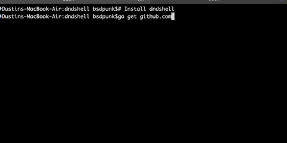

# An all purpose DND Shell

A shell for all things DND. As an avid command line user, and DM, I figued I would change my DMing work flow to more match the automation work flow I use at work and home. Once completed, you won't have to drop into the shell if you don't want you'll be able to feed the commands externally, allowing portions of your DM prep to be scripted. A while ago I made a simple GoLang program to build many many random encounters, based on certain criteria, eventually that will merge with this.

## Installation

If you have go installed, it's easy:

```
go get github.com/bsdpunk/dndshell
```

## Currently Working

Tab Completion, and a workable history of how the shell was used in that instance are working. Listing many things like monsters, races, classes and Spells also work. The Return by Id work on these as well, however you must of course use Id and what is returned is the go struct, not an attractive display. A way to attractively display these things will be added. MonsterByName(mbn), now works but the name must be exact. MonsterByGuess(mbg), now works. MonsterByCR(mcb) now works.




## Not working

Well everything is pretty much half baked, the CreateCharacter command is pretty awful, and will be improved, currently the most complete thing you can get with it, is a half complete blob of JSON representing your character. Let's be honest most things don't work right now, and Nothing's pretty. 

## Import Agenda Items

Getting jsonQL to filter so you can search by name or stats for everything. IE I need 4 CR 5 guys, and someone with at least 3 Special Attacks.
```

{"PlayerName":"Dusty","CharacterName":"Beastie","CharacterClass":{"class_levels":{"class":"Wizard","url":"http://www.dnd5eapi.co/api/classes/wizard/levels"},"hit_die":6,"_id":"","index":12,"name":"Wizard","proficiencies":[{"name":"Daggers","url":"http://www.dnd5eapi.co/api/proficiencies/22"},{"name":"Quarterstaffs","url":"http://www.dnd5eapi.co/api/proficiencies/28"},{"name":"Darts","url":"http://www.dnd5eapi.co/api/proficiencies/32"},{"name":"Slings","url":"http://www.dnd5eapi.co/api/proficiencies/34"}],"proficiency_choices":[{"choose":2,"from":[{"name":"Skill: Arcana","url":"http://www.dnd5eapi.co/api/proficiencies/107"},{"name":"Skill: History","url":"http://www.dnd5eapi.co/api/proficiencies/110"},{"name":"Skill: Insight","url":"http://www.dnd5eapi.co/api/proficiencies/111"},{"name":"Skill: Investigation","url":"http://www.dnd5eapi.co/api/proficiencies/113"},{"name":"Skill: Medicine","url":"http://www.dnd5eapi.co/api/proficiencies/114"},{"name":"Skill: Religion","url":"http://www.dnd5eapi.co/api/proficiencies/119"}],"type":"proficiencies"}],"saving_throws":[{"name":"INT","url":"http://www.dnd5eapi.co/api/ability-scores/4"},{"name":"WIS","url":"http://www.dnd5eapi.co/api/ability-scores/5"}],"starting_equipment":{"class":"Wizard","url":"http://www.dnd5eapi.co/api/startingequipment/12"},"subclasses":[{"name":"Evocation","url":"http://www.dnd5eapi.co/api/subclasses/12"}],"url":"http://www.dnd5eapi.co/api/classes/12"},"CharacterRace":{"ability_bonus_options":{"choose":0,"from":null,"type":""},"ability_bonuses":[{"bonus":2,"name":"INT","url":"http://www.dnd5eapi.co/api/ability-scores/4"}],"age":" Gnomes mature at the same rate humans do, and most are expected to settle down into an adult life by around age 40. They can live 350 to almost 500 years.","alignment":"Gnomes are most often good. Those who tend toward law are sages, engineers, researchers, scholars, investigators, or inventors. Those who tend toward chaos are minstrels, tricksters, wanderers, or fanciful jewelers. Gnomes are good-hearted, and even the tricksters among them are more playful than vicious.","index":6,"language_desc":"You can speak, read, and write Common and Gnomish. The Gnomish language, which uses the Dwarvish script, is renowned for its technical treatises and its catalogs of knowledge about the natural world.","language_options":{"choose":0,"from":null,"type":""},"languages":[{"name":"Common","url":"http://www.dnd5eapi.co/api/languages/1"},{"name":"Gnomish","url":"http://www.dnd5eapi.co/api/languages/5"}],"name":"Gnome","Races":null,"size":"Small","size_description":"Gnomes are between 3 and 4 feet tall and average about 40 pounds. Your size is Small.","speed":25,"starting_proficiencies":[],"starting_proficiency_options":{"choose":0,"from":null,"type":""},"subraces":[{"name":"Rock Gnome","url":"http://www.dnd5eapi.co/api/subraces/4"}],"trait_options":{"choose":0,"from":null,"type":""},"traits":[{"name":"Darkvision","url":"http://www.dnd5eapi.co/api/traits/1"},{"name":"Gnome Cunning","url":"http://www.dnd5eapi.co/api/traits/19"}],"url":"http://www.dnd5eapi.co/api/races/6"},"AbilityScores":{"AbilityScores":null},"CharacterScores":[10,10,10,10,10,10],"CharacterModifiers":[0,0,0,0,0,0],"Actions":0,"BonusAction":0,"Prof":2,"HitPoints":0,"ArmorClass":0,"Initiative":0,"Level":2}
```


## Monsters
Listing all Monsters currently works. Selecting a monster by ID works, but returns a go structure currently. Getting a limited, better formated Statblock works.


## Abilities, Skills and Spells

Abilities and Spells are currently listable and selectable by an ID


```
>
AbilityById     cl              CreateCharacter LevelsById      ListLevels      ll              Quit            rl              sbid
aid             ClassById       d               lid             ListMonster     mid             quit            rl              sid
al              clear           Dice            ListAbilities   ListRaces       ml              RaceById        sb              SpellBook
cid             Clear           ic              ListClasses     ListSpells      MonsterById     rid             SBById          SpellById
> ListClasses
0 Barbarian
1 Bard
2 Cleric
3 Druid
4 Fighter
5 Monk
6 Paladin
7 Ranger
8 Rogue
9 Sorcerer
10 Warlock
11 Wizard
> ListRaces
0 Dwarf
1 Elf
2 Halfling
3 Human
4 Dragonborn
5 Gnome
6 Half-Elf
7 Half-Orc
8 Tiefling

```

## NPCs
You can create NPCs using in or CreateNPC, this is very beta.
